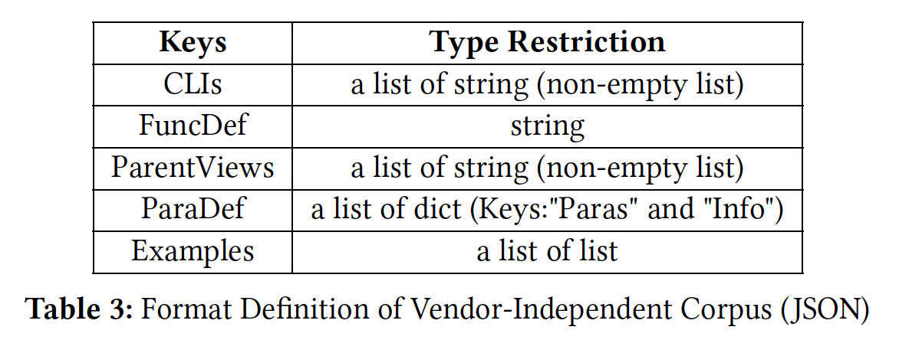

# NAssim

This repository contains the by-products of the following paper: 

**[SIGCOMM 2022]** *Software-Defined Network Assimilation: Bridging the Last Mile Towards Centralized Network Configuration Management with NAssim*. 

## Description

### `corpus` folder

The `corpus` folder contains a validated and expert-curated dataset of parsed manual of network configuration CLI commands of different vendors (Huawei/Nokia). 

The vendor (hw/nokia) subfolders contain the corpus of CLI configuration models in JSON format. The format definition of the vendor-independent corpus is as follows (please refer to the NAssim paper for more details): 

The `hierarchy` subfolder contains the hierarchy of CLI configuration models in JSON format. 

### `manuals_error_ambiguity` folder

The `manuals_error_ambiguity` folder contains the identified errors and ambiguities in manuals of different vendors (Huawei/Cisco/Nokia/H3C). 

For **syntactic errors** of CLI templates, we list the json corpus and relevant html manual pages. 
It is worth mentioning that except Huawei, one html page of Cisco/Nokia/H3C manuals generally contains multiple CLI templates, i.e., multiple resultant json corpus. 

For **hierarchy ambiguities**, we list all ambiguous views not be resolved by the model hierarchy derivation scheme in the NAssim paper, and their relevant html pages.  

p.s., In Section 7.2 of the NAssim paper, only part of Cisco Nexus 5500 manual (i.e., [the part of unicast routing](https://www.cisco.com/c/en/us/td/docs/switches/datacenter/nexus5500/sw/command/reference/unicast/n5500-ucast-cr.html)) is evaluated. In this repo, the `manuals_error_ambiguity/cisco_nexus5500` folder covers the complete Cisco Nexus 5500 manual.

## Configuration Manuals 

The original online manuals can be accessed via the following links:

[Command Reference for Huawei NE40E model](https://support.huawei.com/hedex/hdx.do?docid=EDOC1100218869&lang=en&idPath=24030814%7C9856750%7C22715517%7C9858933%7C15837)

[Command Reference for Nokia 7750 SR model](https://documentation.nokia.com/cgi-bin/doc_list.pl)

[Command Reference for Cisco Nexus 5500 model](https://www.cisco.com/c/en/us/support/switches/nexus-5000-series-switches/products-command-reference-list.html)

[Command Reference for H3C S3600 model](http://www.h3c.com/en/Support/Resource_Center/HK/Switches/H3C_S3600/H3C_S3600_Series_Switches/Technical_Documents/Command/Command/H3C_S3600_CM-Release_1510(V1.04)/)

p.s. Cisco and H3C websites do not provide whole package download option of manuals in the HTML format. [Selenium Python bindings](https://selenium-python.readthedocs.io/) could be helpful. 

### Licensing
---
Please see [LICENSE](./LICENSE) for more information.